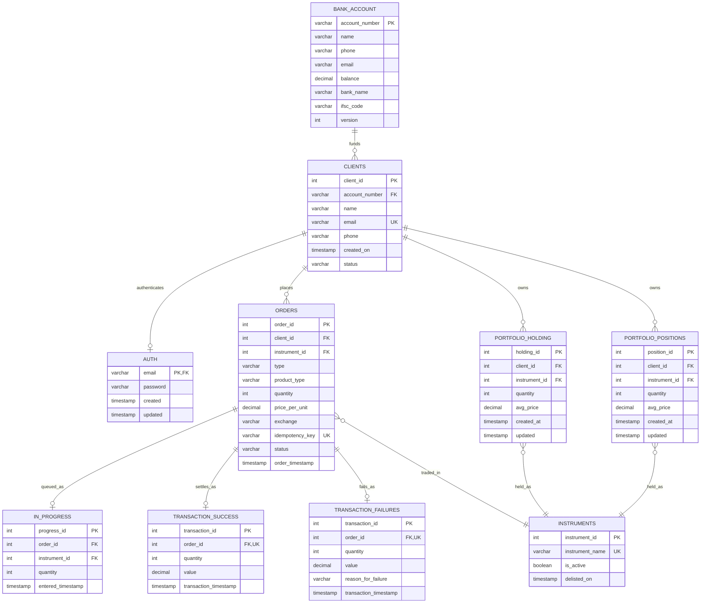

# Trade Database — ERD

Source: [`erd.mmd`](erd.mmd), [`order_lifecycle.mmd`](order_lifecycle.mmd).
Rendered: [`erd.png`](erd.png), [`order_lifecycle.png`](order_lifecycle.png).

## Entity relationship diagram



The instrument relationships are written from the child end
(`ORDERS }o--|| INSTRUMENTS` rather than `INSTRUMENTS ||--o{ ORDERS`). Mermaid
ranks entities by the direction a relationship is written in, and writing them
this way keeps the lines from crossing. The cardinalities are the same either
way. Keep it if you edit the file.

`schema_migrations` is not shown — it is the tracking table used by
`apply_db.py`, not part of the trading model.

### Relationships

| From | To | Cardinality | Meaning |
|---|---|---|---|
| `BANK_ACCOUNT` | `CLIENTS` | 1 → 0..N | Funding account for a client |
| `CLIENTS` | `AUTH` | 1 → 0..1 | Credentials, keyed on email |
| `CLIENTS` | `ORDERS` | 1 → 0..N | Orders placed |
| `ORDERS` | `INSTRUMENTS` | N → 1 | Instrument traded |
| `ORDERS` | `IN_PROGRESS` | 1 → 0..1 | Queued for execution |
| `ORDERS` | `TRANSACTION_SUCCESS` | 1 → 0..1 | Terminal success |
| `ORDERS` | `TRANSACTION_FAILURES` | 1 → 0..1 | Terminal failure |
| `CLIENTS` | `PORTFOLIO_HOLDING` | 1 → 0..N | Delivery book |
| `CLIENTS` | `PORTFOLIO_POSITIONS` | 1 → 0..N | Intraday book |
| `PORTFOLIO_HOLDING` | `INSTRUMENTS` | N → 1 | What is held |
| `PORTFOLIO_POSITIONS` | `INSTRUMENTS` | N → 1 | What is positioned in |

An order reaches one terminal state only: `order_id` is `UNIQUE` in each of the
two terminal tables, and a trigger rejects an insert into either one if a row for
that order exists in the other.

## Order lifecycle


The last step is done in the application layer, not the database.

## The two portfolio tables

`portfolio_positions` has the same columns, types, nullability, unique key and
indexes as `portfolio_holding`. `verify_db.py` compares them column by column.

Two tables rather than one table with a flag, so the application can handle the
two datasets differently — valuation, end-of-day, reporting — without every query
needing a filter, and so an intraday square-off cannot touch delivery holdings.

One difference:

| | `portfolio_holding` | `portfolio_positions` |
|---|---|---|
| Fed by | `product_type = 'DELIVERY'` | `product_type = 'INTRADAY'` |
| `quantity` | `CHECK (quantity >= 0)` | unconstrained |
| Negative quantity | rejected | valid, an open short |
| `quantity = 0` | flat | squared off |

## Settlement arithmetic

`apply_fill()` in [`../scripts/make_seed.py`](../scripts/make_seed.py). Positions
are signed — positive long, negative short.

| Case | New quantity | New `avg_price` |
|---|---|---|
| Opening from flat | `± fill_qty` | fill price |
| Adding to the same side | `qty ± fill_qty` | weighted average of both legs |
| Reducing, same side | `qty ∓ fill_qty` | unchanged |
| Squared off to zero | `0` | `0` |
| Flipped through zero | opposite sign | fill price of the new leg |

`portfolio_holding` only uses the first four rows. A delivery sell can reduce a
holding to zero but not past it.

The seed data is generated by replaying the successful orders through this
function. `verify_db.py` checks D10 and D11 by replaying the orders read back
from the database and comparing against the stored portfolio rows.

## Changes from the original ERD

| Change | Reason |
|---|---|
| `portfolio_positions` added | Intraday positions, separate from delivery holdings |
| `orders.product_type` added | `INTRADAY` / `DELIVERY`, decides which book a fill goes to. `NOT NULL` with no default, so a caller that omits it gets an error instead of booking an intraday fill into holdings |
| `instruments.delisted_on` added | Records when an instrument stopped trading; a `CHECK` keeps it consistent with `is_active` |
| `in_progress` composite FK | `(order_id, instrument_id)` references `orders (order_id, instrument_id)` instead of a plain FK to `instruments` |
| Delete blocked on `clients` and `instruments` | Enforces "never deleted" in the database; `CLOSED` is also one-way |
| Extra `CHECK`s | Positive transaction values, non-blank failure reason, non-blank password, non-negative `version` |
| `instruments.instrument_name` `UNIQUE` | Two rows for the same symbol would make the portfolio ambiguous |

### The in_progress composite FK

`in_progress.instrument_id` duplicates `orders.instrument_id`. Originally both
columns had independent foreign keys, so a queue row could name a different
instrument than its own order and no constraint would catch it.

```sql
FOREIGN KEY (order_id, instrument_id) REFERENCES orders (order_id, instrument_id)
```

The instrument is still guaranteed to exist, through `orders.instrument_id`,
which has its own FK to `instruments`. This is why `IN_PROGRESS` has no direct
line to `INSTRUMENTS` in the diagram.

`in_progress.quantity` also duplicates `orders.quantity` and is not constrained
to match, on the basis that a working quantity may differ from the requested one.
If that is not true here, it needs the same treatment.
