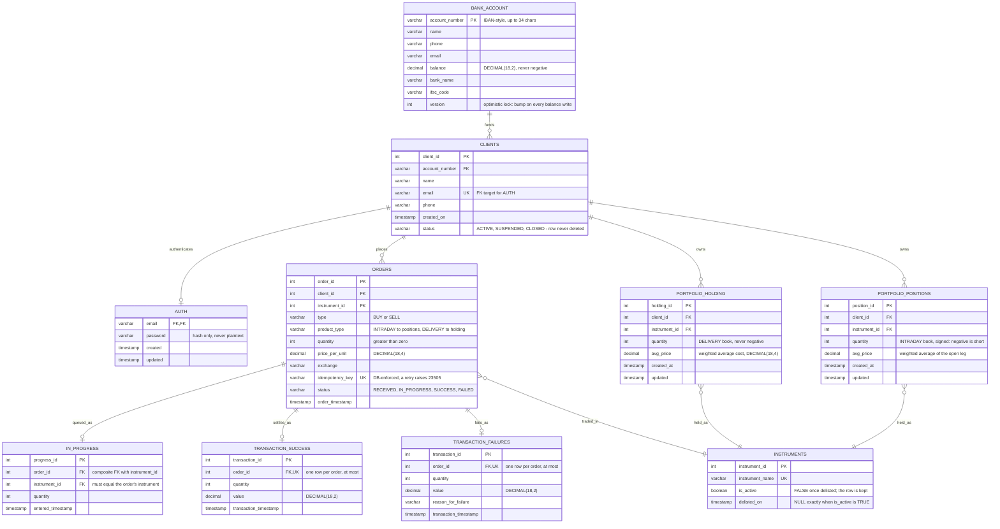
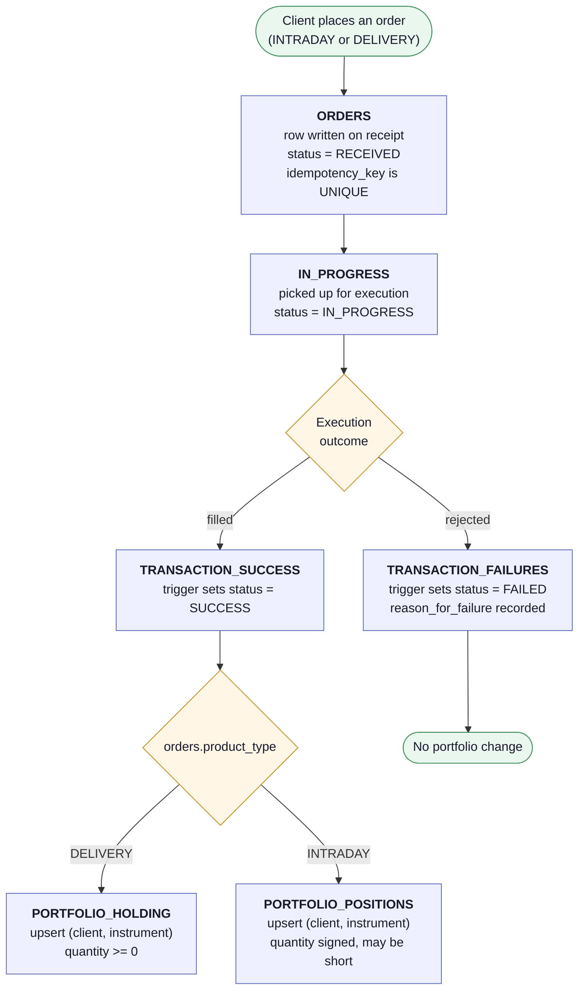

# Trade Database — ERD

Team 1 · Trade Database (Postgres) · SEC3-91 / SEC3-94 / SEC3-95

The diagrams below are the source of truth for the schema shape. The schema
itself is built by `migrations/`, and `scripts/verify_db.py` asserts that what
is actually in the database matches what is described here.

Source files: [`erd.mmd`](erd.mmd), [`order_lifecycle.mmd`](order_lifecycle.mmd).
Rendered: [`erd.png`](erd.png), [`order_lifecycle.png`](order_lifecycle.png).

---

## 1. Entity relationship diagram

> **On the layout.** The relationship lines in this diagram do not cross and no
> line passes behind a table box. That is not luck. Mermaid lays ER diagrams out
> automatically and ranks entities by the *direction* each relationship is
> written in. Written the obvious way — with both `CLIENTS` and `INSTRUMENTS` as
> parents fanning out to `ORDERS`, `PORTFOLIO_HOLDING` and `PORTFOLIO_POSITIONS` —
> those two fans form a K₂,₃ subgraph, which cannot be drawn without crossings in
> a layered layout. Writing the instrument relationships from the child end
> (`ORDERS }o--|| INSTRUMENTS` rather than `INSTRUMENTS ||--o{ ORDERS`) puts
> `CLIENTS` at the top and `INSTRUMENTS` at the bottom with the three child
> tables as parallel paths between them, which *is* drawable flat. The
> cardinalities are identical either way — only the reading direction changes.
> Both renders in this folder were generated and visually checked at 4× scale.



`schema_migrations` is deliberately not shown. It is the apply command's
bookkeeping ledger (created by `migrations/000_migration_ledger.sql`), not part
of the trading domain, and it has no relationships to anything.

### Relationships in words

| From | To | Cardinality | Meaning |
|---|---|---|---|
| `BANK_ACCOUNT` | `CLIENTS` | 1 → 0..N | The funding account a client trades from. |
| `CLIENTS` | `AUTH` | 1 → 0..1 | Login credentials, keyed on the client's unique email. |
| `CLIENTS` | `ORDERS` | 1 → 0..N | A client places orders. |
| `ORDERS` | `INSTRUMENTS` | N → 1 | Every order names exactly one instrument. |
| `ORDERS` | `IN_PROGRESS` | 1 → 0..1 | An order picked up for execution enters the queue. |
| `ORDERS` | `TRANSACTION_SUCCESS` | 1 → 0..1 | Terminal success. |
| `ORDERS` | `TRANSACTION_FAILURES` | 1 → 0..1 | Terminal failure. |
| `CLIENTS` | `PORTFOLIO_HOLDING` | 1 → 0..N | The client's delivery book. |
| `CLIENTS` | `PORTFOLIO_POSITIONS` | 1 → 0..N | The client's intraday book. |
| `PORTFOLIO_HOLDING` | `INSTRUMENTS` | N → 1 | What is held. |
| `PORTFOLIO_POSITIONS` | `INSTRUMENTS` | N → 1 | What is positioned in. |

An order reaches **exactly one** terminal state: `order_id` is `UNIQUE` in each
of the two terminal tables, and a trigger rejects an insert into either one when
a row for that order already exists in the other.

---

## 2. Order lifecycle

This is the path an order walks, and where `product_type` decides which
portfolio book a fill lands in.



**The database does not perform the last step.** Reading a terminal transaction
and upserting the right portfolio table is application-layer work, by design.
The database's job is to make the routing decision *unambiguous* and the two
books *structurally distinct*.

---

## 3. The two portfolio tables

`PORTFOLIO_POSITIONS` is a structural copy of `PORTFOLIO_HOLDING`: same columns,
same types, same nullability, same `UNIQUE (client_id, instrument_id)`, same
indexes. `scripts/verify_db.py` compares the two column by column and fails if
they drift apart.

They are two tables rather than one table with a flag so the application can
treat the datasets differently — different valuation, different end-of-day
handling, different reporting — without every query having to remember a filter,
and so an intraday square-off can never accidentally touch long-term holdings.

There is exactly **one** intentional difference:

| | `portfolio_holding` | `portfolio_positions` |
|---|---|---|
| Fed by | `product_type = 'DELIVERY'` | `product_type = 'INTRADAY'` |
| `quantity` | `CHECK (quantity >= 0)` | **unconstrained** |
| Negative quantity | rejected — you cannot hold negative stock | valid: an open **short** |
| `quantity = 0` | flat | squared off |

`avg_price` is the weighted average of the open quantity in both tables. On the
short side it is the average price of the open leg.

---

## 4. Settlement arithmetic

The reference implementation lives in `apply_fill()` in
[`../scripts/make_seed.py`](../scripts/make_seed.py) and is what the application
layer should mirror. Positions are signed throughout — positive long, negative
short:

| Case | New quantity | New `avg_price` |
|---|---|---|
| Opening from flat | `± fill_qty` | fill price |
| Adding to the same side | `qty ± fill_qty` | weighted average of the two legs |
| Reducing, same side | `qty ∓ fill_qty` | unchanged — cost basis is preserved |
| Squared off to zero | `0` | `0` |
| Flipped through zero | opposite sign | fill price of the new leg |

`portfolio_holding` only ever exercises the first four rows; a delivery sell may
reduce a holding to zero but is never allowed past it.

The seed data is generated by replaying every successful order through exactly
this function, and `verify_db.py` checks D10/D11 by replaying the orders *read
back out of the database* and comparing against the stored portfolio rows. So
the two books cannot silently disagree with the orders that produced them.

---

## 5. What changed from the original ERD

| Change | Why |
|---|---|
| **`portfolio_positions` added** | Intraday positions, kept separate from delivery holdings. |
| **`orders.product_type` added** | `INTRADAY` / `DELIVERY`. `NOT NULL` with **no default**, so a caller that forgets it gets an error rather than silently booking an intraday fill into holdings. |
| `instruments.delisted_on` added | Records *when* an instrument stopped trading; a `CHECK` keeps it consistent with `is_active`. |
| `in_progress` → composite FK | `(order_id, instrument_id)` now references `orders (order_id, instrument_id)` instead of a plain FK to `instruments`. See below. |
| `clients` / `instruments` delete blocked | Triggers enforce "never deleted" rather than leaving it to convention. `CLOSED` is also made one-way in the database. |
| Extra `CHECK`s | Positive transaction values, non-blank failure reason, non-blank password, non-negative `version`. |
| `instruments.instrument_name` `UNIQUE` | Two rows for the same symbol would make the portfolio ambiguous. |

### The `in_progress` composite FK

`in_progress.instrument_id` duplicates `orders.instrument_id`. In the original
schema both columns had independent foreign keys, and **nothing stopped them
disagreeing** — a queue row could claim order 5 was for INFY while the order
itself said RELIANCE, and no constraint would object. That is the kind of
mismatch that shows up much later as a fill booked against the wrong instrument.

The fix is a single composite foreign key:

```sql
FOREIGN KEY (order_id, instrument_id) REFERENCES orders (order_id, instrument_id)
```

which makes disagreement impossible. The instrument is still guaranteed to exist,
transitively, because `orders.instrument_id` has its own FK to `instruments`.
This is why `IN_PROGRESS` has no line to `INSTRUMENTS` in the diagram above —
it reaches instruments *through* its order, which is the only correct route.

`in_progress.quantity` similarly duplicates `orders.quantity` and is **not**
constrained to match, on the grounds that a working quantity may legitimately
differ from the requested one. If that turns out not to be true for this
platform, it deserves the same treatment.
