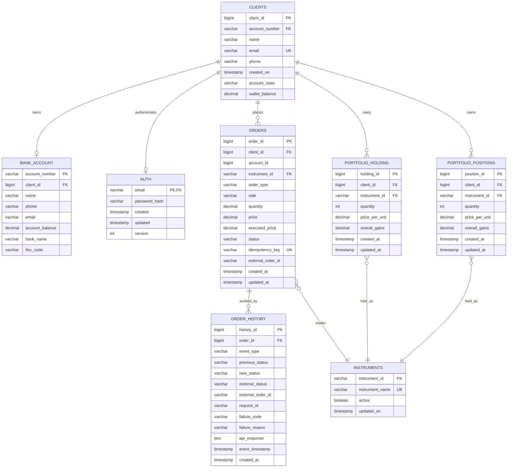
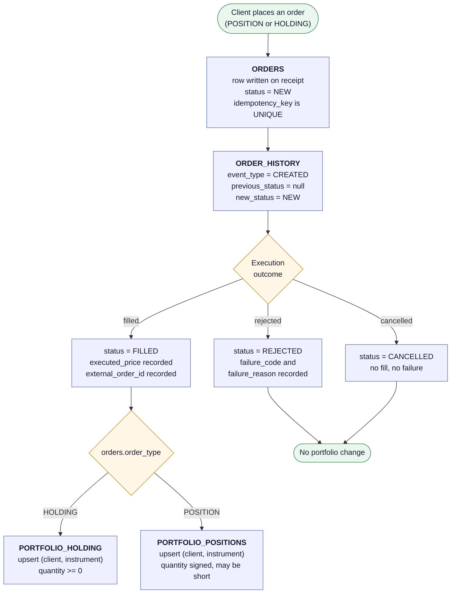

# Trade Database — ERD

Source: [`erd.mmd`](erd.mmd), [`order_lifecycle.mmd`](order_lifecycle.mmd).
Rendered: [`erd.png`](erd.png), [`order_lifecycle.png`](order_lifecycle.png).

## Where the schema comes from

The tables mirror the domain entities in
[`sprint-05-domain-engine`](../sprint-05-domain-engine/src/main/java/com/team1/trading/domain/entity).
One table per entity class, one column per field, snake_case of the field name.
The only name that is not a mechanical conversion is the abstract
`PortfolioEntry.portifolioid`, which the two concrete tables call `holding_id`
and `position_id`.

This is not a convention anyone has to remember. `verify_db.py` parses the
entity classes and the enums, and fails if a table has a column no field maps
to, if a field has no column, or if a `CHECK` vocabulary differs from the Java
enum it stands for. Adding a field to an entity without a migration breaks the
build, and so does the reverse.

## Entity relationship diagram

The instrument relationships are written from the child end
(`ORDERS }o--|| INSTRUMENTS` rather than `INSTRUMENTS ||--o{ ORDERS`). Mermaid
ranks entities by the direction a relationship is written in, and writing them
this way keeps the lines from crossing. The cardinalities are the same either
way. Keep it if you edit the file.

`schema_migrations` is not shown — it is the tracking table used by
`apply_db.py`, not part of the trading model.

### Relationships

| From | To | Cardinality | Meaning |
|---|---|---|---|
| `CLIENTS` | `BANK_ACCOUNT` | 1 → 0..1 | Funding account |
| `CLIENTS` | `AUTH` | 1 → 0..1 | Credentials, keyed on email |
| `CLIENTS` | `ORDERS` | 1 → 0..N | Orders placed |
| `ORDERS` | `ORDER_HISTORY` | 1 → 0..N | Audit trail of status changes |
| `ORDERS` | `INSTRUMENTS` | N → 1 | Instrument traded |
| `CLIENTS` | `PORTFOLIO_HOLDING` | 1 → 0..N | Delivery book |
| `CLIENTS` | `PORTFOLIO_POSITIONS` | 1 → 0..N | Intraday book |
| `PORTFOLIO_HOLDING` | `INSTRUMENTS` | N → 1 | What is held |
| `PORTFOLIO_POSITIONS` | `INSTRUMENTS` | N → 1 | What is positioned in |

### Clients and bank accounts point at each other

`Client.accountNumber` and `BankAccount.clientId` both exist in the entities, so
both exist as columns, and both carry a foreign key. That is a cycle: neither
table can be loaded first if both keys are checked immediately.

`fk_bank_account_client` is therefore `DEFERRABLE INITIALLY DEFERRED` — checked
at `COMMIT` rather than at `INSERT`. The seed loader and the docker init script
both load every CSV inside one transaction for this reason, and
`tests/test_migrations.py` asserts that loading `bank_account` on its own fails,
so nobody can quietly split that transaction back up.

## Instruments are keyed by their symbol

`instruments.instrument_id` is the symbol itself (`RELIANCE`, `TCS`), a
`VARCHAR(20)` primary key, because `Instrument.instrumentId` is a `String` and
every entity that references an instrument does so by that string.
`instrument_name` is the human-readable company name and is `UNIQUE`.

The cost is a wider foreign key in `orders` and both portfolio tables; the
benefit is that no symbol-to-id lookup is needed at the boundary between the
domain layer and the database.

## Order lifecycle

The last step is done in the application layer, not the database.

`ORDER_HISTORY` is the audit trail: one row per status change, carrying the
transition (`previous_status` → `new_status`), the external system's view of it
(`external_status`, `external_order_id`, `request_id`, `api_response`) and, on a
rejection, `failure_code` and `failure_reason`. A `CHECK` rejects a row whose
`previous_status` equals its `new_status`, so an event that records no change
cannot be written.

## The two portfolio tables

`portfolio_positions` has the same columns, types, nullability, unique key and
indexes as `portfolio_holding`. `verify_db.py` compares them column by column.

Two tables rather than one table with a flag, so the application can handle the
two datasets differently — valuation, end-of-day, reporting — without every query
needing a filter, and so an intraday square-off cannot touch delivery holdings.

One difference:

| | `portfolio_holding` | `portfolio_positions` |
|---|---|---|
| Fed by | `order_type = 'HOLDING'` | `order_type = 'POSITION'` |
| `quantity` | `CHECK (quantity >= 0)` | unconstrained |
| Negative quantity | rejected | valid, an open short |
| `quantity = 0` | flat | squared off |

## Settlement arithmetic

`apply_fill()` in [`../scripts/make_seed.py`](../scripts/make_seed.py). Positions
are signed — positive long, negative short.

| Case | New quantity | New `price_per_unit` |
|---|---|---|
| Opening from flat | `± fill_qty` | fill price |
| Adding to the same side | `qty ± fill_qty` | weighted average of both legs |
| Reducing, same side | `qty ∓ fill_qty` | unchanged |
| Squared off to zero | `0` | `0` |
| Flipped through zero | opposite sign | fill price of the new leg |

`portfolio_holding` only uses the first four rows. A delivery sell can reduce a
holding to zero but not past it.

The seed data is generated by replaying the `FILLED` orders through this
function at their `executed_price`. `verify_db.py` checks D12 and D13 by
replaying the orders read back from the database and comparing against the
stored portfolio rows.

## Changes made to align the schema with the entities

The schema originally modelled a settlement queue and two terminal-state tables.
The domain entities model the same lifecycle with a status column and an audit
trail instead. The tables now follow the entities.

| Change | Reason |
|---|---|
| `orders.status` vocabulary is `NEW / FILLED / REJECTED / CANCELLED` | Matches `OrderStatus.java`. The previous `RECEIVED / IN_PROGRESS / SUCCESS / FAILED` shared no value with the enum |
| `orders.product_type` → `orders.order_type` | Matches `OrderType.java`: `POSITION` / `HOLDING` rather than `INTRADAY` / `DELIVERY` |
| `orders.type` → `orders.side` | Matches `Order.side`, typed by `OrderSide.java` |
| `orders.price_per_unit` → `price`, `order_timestamp` → `created_at` | Field names on `Order` |
| `orders.account_id`, `executed_price`, `external_order_id`, `updated_at` added | Fields on `Order` with no column before |
| `orders.exchange` dropped | No field on any entity |
| `order_history` added | `OrderHistory.java` had no table at all |
| `in_progress`, `transaction_success`, `transaction_failures` dropped | No entity models them; the audit trail replaces them |
| `instruments.instrument_id` is now the symbol | `Instrument.instrumentId` is a `String` |
| `instruments.is_active` → `active`, `delisted_on` → `updated_on` | Field names on `Instrument` |
| `chk_instruments_delisted_consistent` dropped | It required `delisted_on` whenever `is_active` was false, which `Instrument.deactivate()` cannot satisfy — it sets only the flag |
| `clients.status` → `account_state`, `wallet_balance` added | Fields on `Client` |
| `auth.password` → `password_hash`, `version` added | Fields on `Auth` |
| `bank_account.client_id` added, `version` dropped | `BankAccount` has the former and not the latter |
| `bank_account.balance` → `account_balance` | Field name on `BankAccount` |
| `portfolio_*.avg_price` → `price_per_unit`, `updated` → `updated_at`, `overall_gains` added | Fields on `PortfolioEntry` |
| Optimistic concurrency moved to `auth.version` | `bank_account` lost its `version` column; `Auth` is the entity that carries one, and `changePassword()` increments it |

### Two things the entities leave open

`Order.accountId` has no obvious referent. `PortfolioService` looks accounts up
by it in a `Map<Long, Client>` and then reads `getClientId()` off the result, so
the two are not the same identifier, but nothing says what `accountId` points
at. `bank_account` is keyed by a `VARCHAR` account number, so it cannot be that.
The column is `BIGINT NOT NULL` with no foreign key, and the seed sets it equal
to `client_id`. It needs a decision before Sprint 6 wires a repository to it.

`OrderStatus` has no `IN_PROGRESS` constant, but `Order.markInProgress()` exists
and sets the status to `NEW`. The class diagram in `Diagrams/mermaid_UML.txt`
does list `IN_PROGRESS`. The database follows the enum, not the diagram, because
the enum is what compiles. If `IN_PROGRESS` is added to `OrderStatus`, the
parity check fails until a migration adds it to the three `CHECK` constraints
that name the status vocabulary.
